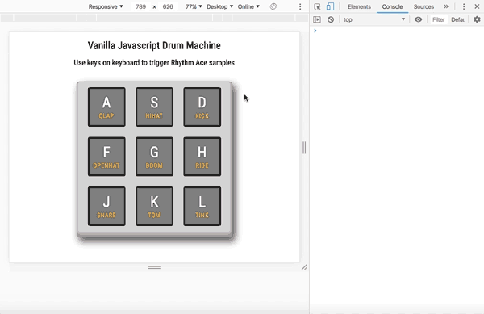

# javascript-drumkit

## The samples are from a vintage analog Ace-Tone Rhythm King.

### The script uses html5's native audio play method, and we bind each sample to a keyboard key's with its unicode value. 

### Inspired by [this project](https://github.com/wesbos/JavaScript30/tree/master/01%20-%20JavaScript%20Drum%20Kit).

### Probably doesn't work on a phone.

### Try it with sound [here](https://theemattoliver.github.io/javascript-drumkit).

